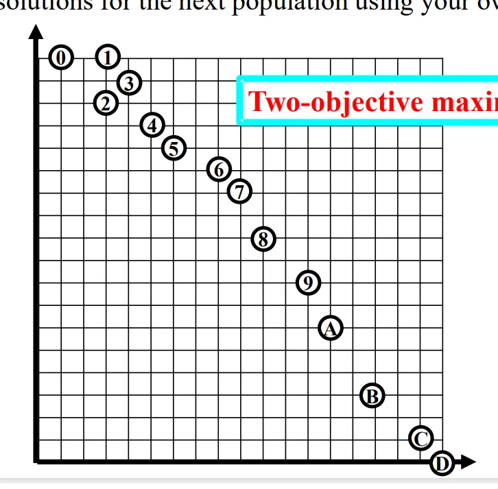

  

 

# Homework13_12412639_ WangSiyu

Below I assume **two-objective maximization**, with coordinates:

0(1,18), 1(3,18), 2(3,16), 3(4,17), 4(5,15), 5(6,14), 6(8,13), 7(9,12), 8(10,10), 9(12,8), A(13,6), B(15,3), C(17,1), D(18,0).

## Task 1: NSGA-II selection of 7 solutions

For maximization, point **0** is dominated by point **1**, and point **2** is dominated by points **1** and **3**.

So the first nondominated front is:
$$
F_1={1,3,4,5,6,7,8,9,A,B,C,D}
$$
Since $ |F_1|=12>7 $, NSGA-II uses **crowding distance** to select 7 from $F_1$.

Approximate crowding distances:

| Solutions |         | $f_1$ contribution | $f_2$ $f_1$ contribution | Crowding Distance |
| --------- | ------- | ------------------ | ------------------------ | ----------------- |
| 1         | (3,18)  | ∞                  | ∞                        | ∞                 |
| 3         | (4,17)  | $(5-3)/15=0.133$   | $(18-15)/18=0.167$       | 0.300             |
| 4         | (5,15)  | $(6-4)/15=0.133$   | $(17-14)/18=0.167$       | 0.300             |
| 5         | (6,14)  | $(8-5)/15=0.200$   | $(15-13)/18=0.111$       | 0.311             |
| 6         | (8,13)  | $(9-6)/15=0.200$   | $(14-12)/18=0.111$       | 0.311             |
| 7         | (9,12)  | $(10-8)/15=0.133$  | $(13-10)/18=0.167$       | 0.300             |
| 8         | (10,10) | $(12-9)/15=0.200$  | $(12-8)/18=0.222$        | 0.422             |
| 9         | (12,8)  | $(13-10)/15=0.200$ | $(10-6)/18=0.222$        | 0.422             |
| A         | (13,6)  | $(15-12)/15=0.200$ | $(8-3)/18=0.278$         | 0.478             |
| B         | (15,3)  | $(17-13)/15=0.267$ | $(6-1)/18=0.278$         | 0.544             |
| C         | (17,1)  | $(18-15)/15=0.200$ | $(3-0)/18=0.167$         | 0.367             |
| D         | (18,0)  | ∞                  | ∞                        | ∞                 |

Therefore, NSGA-II selects:

$$
\boxed{{1,8,9,A,B,C,D}}
$$

Coordinates:

$$
\boxed{(3,18),(10,10),(12,8),(13,6),(15,3),(17,1),(18,0)}
$$

This result is not very uniform. It selects many solutions on the lower-right side and loses many solutions from the upper-left and middle region.

------

## Task 2

A good EMO algorithm should keep both convergence and diversity. Since all first-front solutions are nondominated, I would mainly focus on **uniform distribution along the Pareto front**.

My idea: keep the two extreme points, then select points that are approximately equally spaced along the front.

A better selection is:

$$
\boxed{{1,4,6,8,A,B,D}}
$$

Coordinates:

$$
\boxed{(3,18),(5,15),(8,13),(10,10),(13,6),(15,3),(18,0)}
$$

This set covers the front more evenly than the original NSGA-II result. It includes the upper-left, middle, and lower-right regions.

------

## Task 3

The problem in Task 1 is that NSGA-II calculates crowding distance only once before selection. After one solution is selected or removed, the local density changes, but the crowding distances are not updated.

My modification is:

### Crowding Distance Recalculation NSGA-II

Use nondominated sorting as usual. But when the last accepted front has too many solutions, do this:

1. Put all candidate solutions from the last front into a temporary set.
2. Calculate crowding distance.
3. Remove the solution with the smallest crowding distance.
4. Recalculate crowding distance again.
5. Repeat until the required population size is reached.

For this example, the removal process can be:

$$
3 \rightarrow 7 \rightarrow 5 \rightarrow C \rightarrow 9
$$

So the remaining 7 solutions are:

$$
\boxed{{1,4,6,8,A,B,D}}
$$

This is the same as my Task 2 result. The advantage is that the algorithm dynamically updates the density information, so it avoids keeping too many solutions in one crowded or sparse-biased region.

------

## Task 4

For three-objective or many-objective problems, ordinary crowding distance is weak because it is calculated separately on each objective axis. Two solutions may look far apart on one axis but still be very close in the real multidimensional objective space.

So I would replace crowding distance with a **normalized multidimensional distance-based diversity mechanism**.

### Proposed mechanism: k-nearest-neighbor crowding

First normalize each objective:

$$
z_m(i)=\frac{f_m(i)-f_m^{min}}{f_m^{max}-f_m^{min}}
$$

Then calculate the Euclidean distance between solutions in the normalized objective space.

For each solution, calculate its average distance to its (k) nearest neighbors:

$$
D(i)=\frac{1}{k}\sum_{j \in kNN(i)} ||z(i)-z(j)||
$$

A larger $D(i)$ means the solution is in a less crowded region.

When selecting the last front:

1. Keep extreme solutions for each objective.
2. Compute normalized multidimensional distances.
3. Remove the solution with the smallest $D(i)$, meaning the most crowded solution.
4. Recalculate distances.
5. Repeat until the population size is correct.

This method uses the real geometry of the 3D or many-objective objective space, not only axis-wise gaps. Therefore, it can produce a more uniformly distributed solution set than the original NSGA-II crowding distance.

A stronger version is to use **reference directions**, similar to NSGA-III:

1. Generate uniformly distributed reference directions.
2. Assign each solution to its nearest reference direction.
3. Select solutions from underrepresented directions first.
4. Within each direction, choose the solution closest to the reference direction or with the best convergence.

This gives better uniformity for three or more objectives because diversity is controlled over the whole Pareto front surface, not separately on each axis.