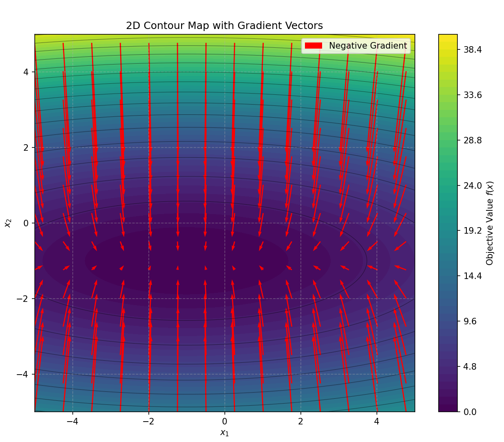
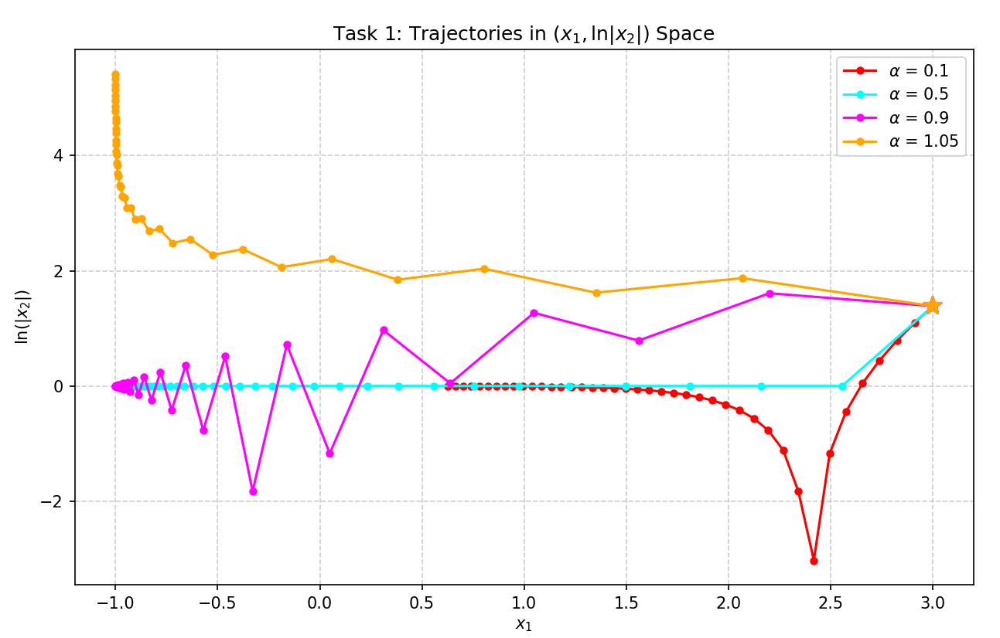
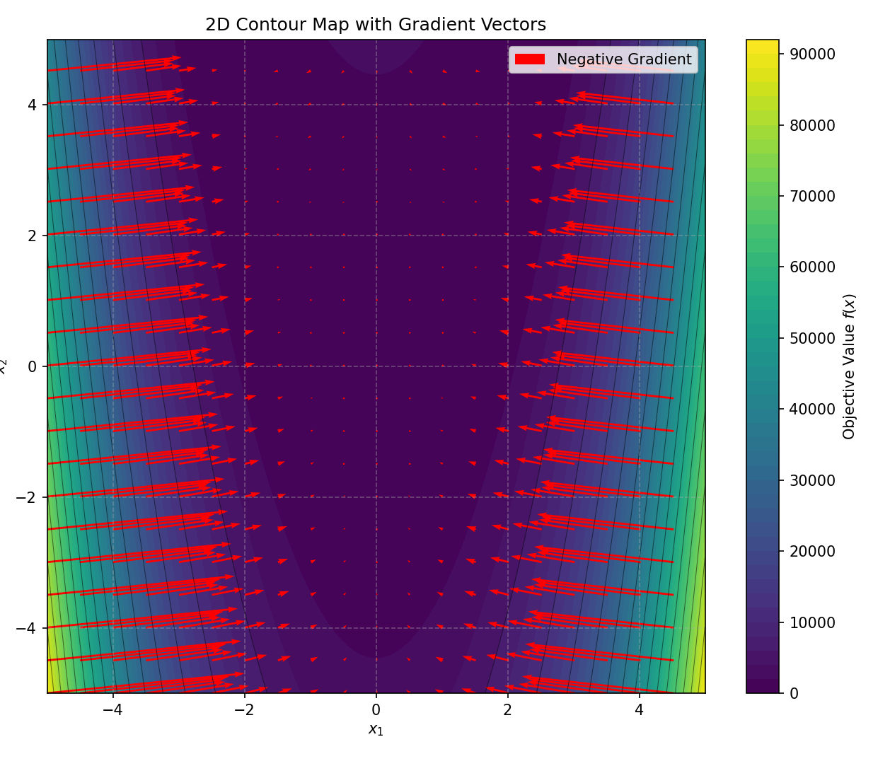
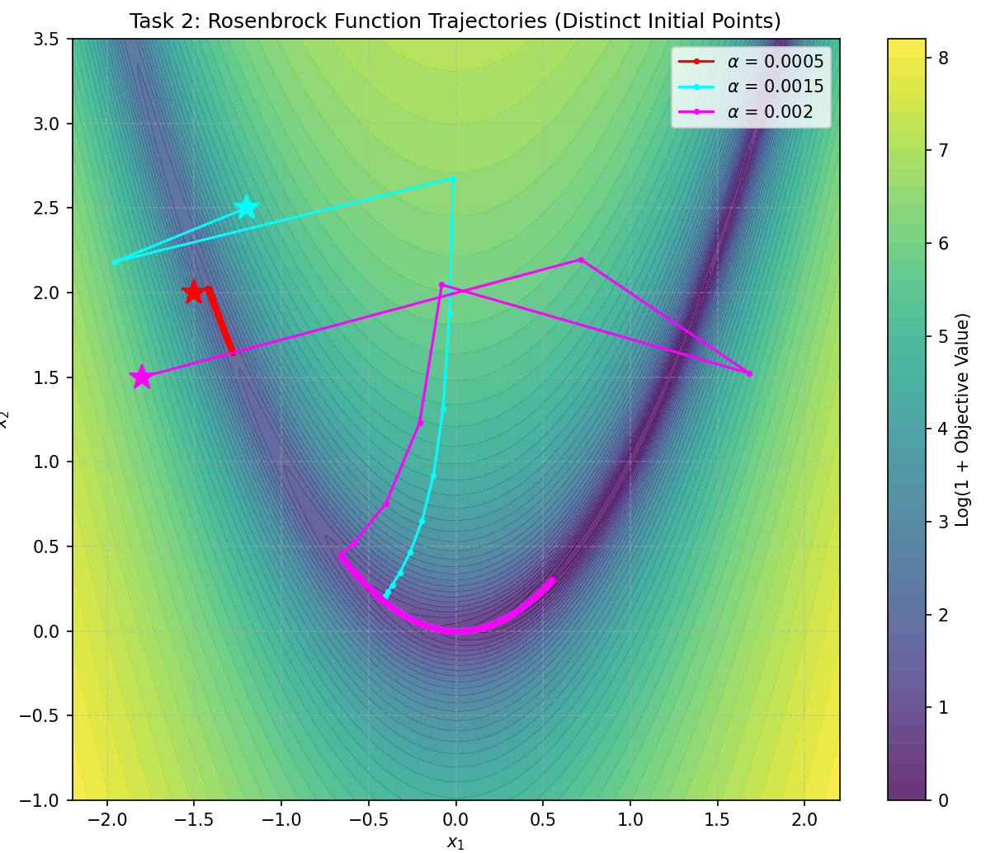

Homework10_12412639_ WangSiyu

**Gradient Descent Algorithm (Constant Step Size)** 

The algorithm utilizes a constant step size $\alpha$ to update the solution vector $x$ iteratively:

$x^{(k+1)} = x^{(k)} - \alpha \nabla f(x^{(k)})$  where:

- $x^{(k)}$ is the value of $x$ at the $k$-th iteration.
- $\alpha$ is a positive constant representing the step size.
- $\nabla f(x^{(k)})$ is the gradient of the objective function at the current point.

# Q1

## Problem Formulation

- **Minimize:** $f(x) = \frac{(x_1+1)^2}{9} + (x_2+1)^2$ 

- **Gradient:** $\nabla f(x) = \left( \frac{2(x_1+1)}{9}, 2(x_2+1) \right)^T$ 

- **Constraints:** Initial solution chosen in the range $[-5, 5] \times [-5, 5]$.

  

## Search Behavior Analysis 



- **Small Step Size ($\alpha \approx 0.5$):** The algorithm demonstrates stable convergence toward the global minimum at $(-1, -1)$. The $x_2$ component converges rapidly due to higher sensitivity, while $x_1$ moves steadily without oscillation.

- **Large Step Size ($\alpha \ge 1.0$):** High sensitivity in the $x_2$ direction causes the solution to oscillate across the steep contour lines, preventing efficient convergence.

```
============================================================
      Task 1: Quadratic Function Optimization Results       
============================================================
Alpha    | Iter  | Final x1   | Final x2   | Final f(x)  
------------------------------------------------------------
0.10     | 40    | 0.628045   | -0.999335  | 2.945040e-01
0.50     | 40    | -0.964028  | -1.000000  | 1.437725e-04
0.90     | 40    | -0.999468  | -0.999335  | 4.731224e-07
1.05     | 40    | -0.999903  | 225.296278 | 5.121001e+04
```

## Data Analysis

The global minimum for this objective function is located at $(x_1, x_2) = (-1, -1)$, where $f(x) = 0$. The data shows how different step sizes ($\alpha$) affect the algorithm's behavior over 40 iterations:

- **$\alpha = 0.10$**: The algorithm is too conservative. While the $x_2$ dimension converges nicely to $-0.999$, the $x_1$ dimension (which has a much flatter gradient) only reaches $0.628$. The final objective value ($2.94 \times 10^{-1}$) indicates it has not yet reached the minimum.
- **$\alpha = 0.50$**: This step size shows significant improvement. The $x_2$ dimension hits the exact minimum ($-1.0$), and $x_1$ gets very close ($-0.964$), yielding a much smaller error ($1.43 \times 10^{-4}$).
- **$\alpha = 0.90$**: This is the optimal step size among the tested values. Both $x_1$ and $x_2$ converge extremely close to $-1.0$, resulting in an excellent final objective value of $4.73 \times 10^{-7}$. 
- **$\alpha = 1.05$**: The algorithm diverges violently. While $x_1$ appears stable, the step size exceeds the stability limit for the steeper $x_2$ dimension, causing $x_2$ to explode to $225.29$ and the objective value to spike to $5.12 \times 10^4$.

## Conclusion

For functions with varying sensitivities across different dimensions, the step size must be carefully tuned. A step size that is too small leads to unacceptably slow convergence along flatter dimensions (like $x_1$). A step size that is too large will cause divergence and catastrophic oscillation along steeper dimensions (like $x_2$). An $\alpha$ of 0.90 provides the best balance of speed and stability for this specific quadratic surface.

# Q2

## Problem Formulation

- **Minimize:** $f(x) = (1-x_1)^2 + 100(x_2-x_1^2)^2$ 

- **Gradient:** $\nabla f(x) = \left( -2(1-x_1) - 400x_1(x_2-x_1^2), 200(x_2-x_1^2) \right)^T$ 

- **Characteristics:** This is the Rosenbrock function, characterized by a narrow, curved valley.

  

## Search Behavior Analysis

- **Optimal Step Size ($\alpha \approx 0.001$):** Because the objective function is extremely sensitive to changes in $x_1$ near the valley walls, a very small step size is required to navigate the high-curvature contours and avoid divergence.

- **Ineffective Step Size ($\alpha \ge 0.01$):** Even moderate step sizes cause the algorithm to overshoot the valley floor, leading to rapid divergence or persistent oscillations between the steep walls.



```
============================================================
      Task 2: Rosenbrock Function Optimization Results      
============================================================
Alpha    | Init Pt (x1, x2)   | Final x1  | Final x2  | Final f(x)  
------------------------------------------------------------
0.0005   | (-1.5, 2.0)        | -1.27911  | 1.64384   | 5.200292e+00
0.0015   | (-1.2, 2.5)        | 0.51731   | 0.26519   | 2.335771e-01
0.0020   | (-1.8, 1.5)        | 0.55282   | 0.30338   | 2.004635e-01
```

## Data Analysis

The Rosenbrock function is notorious for its steep, curved valley. The global minimum is at $(x_1, x_2) = (1, 1)$, where $f(x) = 0$. Because the valley walls are extremely steep, the step sizes used are magnitudes smaller than in Task 1.

- **$\alpha = 0.0005$**: Starting from $(-1.5, 2.0)$, the algorithm makes very little progress after 500 iterations. It only reaches $(-1.27, 1.64)$ with a high final error of $5.20$. This step size is overly cautious, preventing the algorithm from efficiently traversing the valley floor.
- **$\alpha = 0.0015$**: Starting from $(-1.2, 2.5)$, the search successfully navigates deeper into the valley, reaching $(0.517, 0.265)$. The objective value drops significantly to $0.233$, demonstrating effective, stable progress without jumping out of the valley.
- **$\alpha = 0.0020$**: Starting from $(-1.8, 1.5)$, this step size pushes the algorithm further along the valley path, reaching $(0.552, 0.303)$ and achieving the lowest final objective value in the dataset ($0.200$). It remains stable over 500 iterations without oscillating out of control.

## Conclusion

When optimizing highly non-linear problems like the Rosenbrock function, standard gradient descent is heavily constrained by the steepness of the valley walls. Large step sizes will instantly cause divergence. However, setting the step size too low (like 0.0005) results in near-stagnation. Based on the data, $\alpha = 0.0020$ is the most effective step size tested, allowing the algorithm to maximize its movement along the narrow valley floor towards the global minimum without triggering instability.