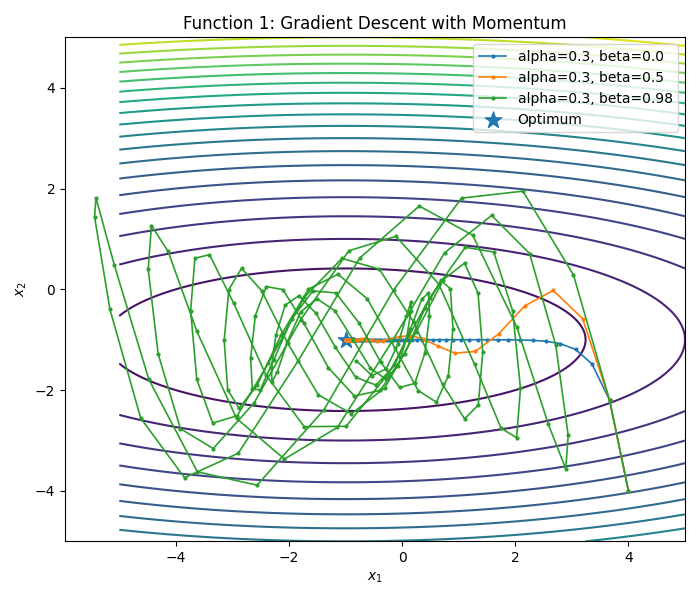
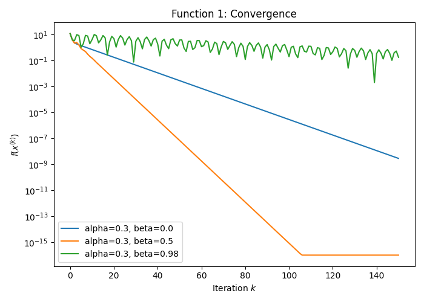
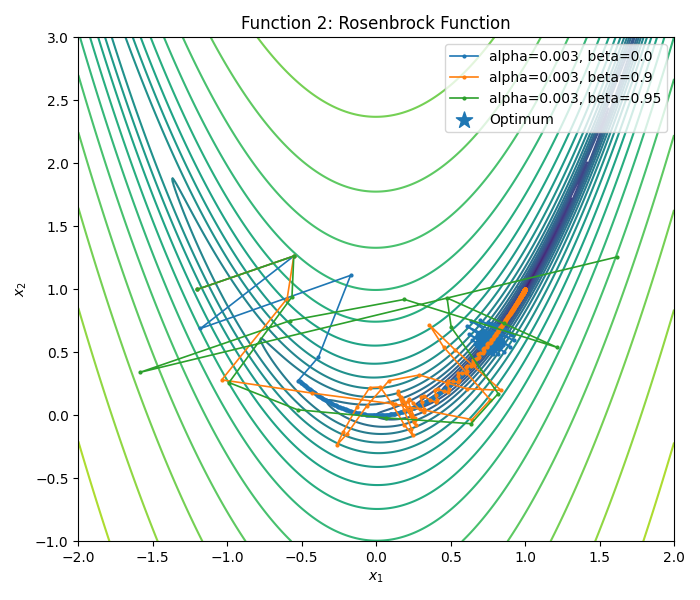
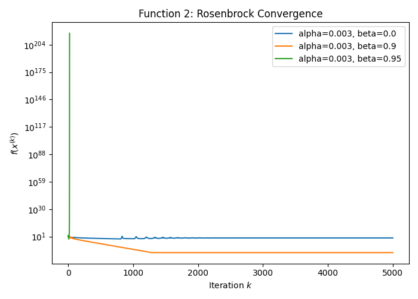
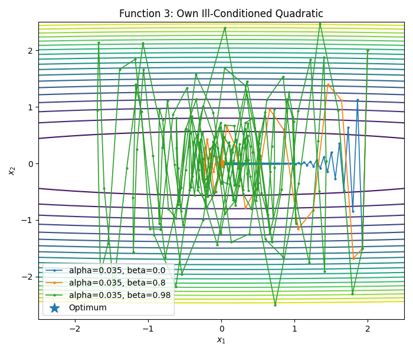
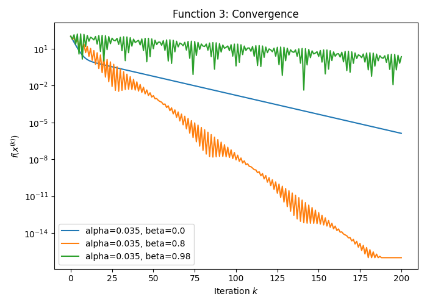

<br><br>

<br>

# Homework6_12412639_ WangSiyu


### 1. Algorithm formulas

Standard gradient descent:

$$
x^{(k+1)}=x^{(k)}-\alpha \nabla f(x^{(k)})
$$

Gradient descent with momentum:

$$
x^{(k+1)}=x^{(k)}
-\alpha \nabla f(x^{(k)})
+\beta \left(x^{(k)}-x^{(k-1)}\right)
$$

where $\alpha>0$ is the constant step size and $\beta\in[0,1)$ is the momentum coefficient. When $\beta=0$, the method becomes standard gradient descent.

Velocity form:

$$
v^{(k+1)}=\beta v^{(k)}-\alpha \nabla f(x^{(k)})
$$

$$
x^{(k+1)}=x^{(k)}+v^{(k+1)}
$$

### 2. Test functions and gradients

**Function 1:**

$$
f_1(x)=\frac{(x_1+1)^2}{9}+(x_2+1)^2
$$

$$
\nabla f_1(x)=
\begin{bmatrix}
\frac{2(x_1+1)}{9}\
2(x_2+1)
\end{bmatrix}
$$

Optimum:

$$
x^*=(-1,-1),\qquad f_1(x^*)=0
$$

 

**Function 2: Rosenbrock function**

$$
f_2(x)=(1-x_1)^2+100(x_2-x_1^2)^2
$$

$$
\nabla f_2(x)=
\begin{bmatrix}
2(x_1-1)-400x_1(x_2-x_1^2)\
200(x_2-x_1^2)
\end{bmatrix}
$$

Optimum:

$$
x^*=(1,1),\qquad f_2(x^*)=0
$$
 

**Function 3: own ill-conditioned quadratic function**

$$
f_3(x)=\frac{1}{2}x_1^2+25x_2^2
$$

$$
\nabla f_3(x)=
\begin{bmatrix}
x_1\
50x_2
\end{bmatrix}
$$

Optimum:

$$
x^*=(0,0),\qquad f_3(x^*)=0
$$

 

### 3. Experimental conclusions

```assembly
          function  alpha  ...        best_f  first_iter_f_less_than_1e-6
0               f1  0.300  ...  2.849250e-09                        108.0
1               f1  0.300  ...  9.979929e-24                         43.0
2               f1  0.300  ...  2.002808e-03                          NaN
3    f2_Rosenbrock  0.003  ...  2.781816e-02                          NaN
4    f2_Rosenbrock  0.003  ...  4.449669e-30                        450.0
5    f2_Rosenbrock  0.003  ...           NaN                          NaN
6  f3_own_function  0.035  ...  1.294063e-06                          NaN
7  f3_own_function  0.035  ...  2.513558e-19                         74.0
8  f3_own_function  0.035  ...  4.270763e-03                          NaN
```


| Function | Setting                     | Result                                                    |
| -------- | --------------------------- | --------------------------------------------------------- |
| $f_1$    | $\alpha=0.30,\ \beta=0$     | Reaches $f<10^{-6}$ after about 108 iterations            |
| $f_1$    | $\alpha=0.30,\ \beta=0.50$  | Reaches $f<10^{-6}$ after about 43 iterations             |
| $f_1$    | $\alpha=0.30,\ \beta=0.98$  | Strong oscillation; after 150 iterations, $f\approx0.178$ |
| $f_2$    | $\alpha=0.003,\ \beta=0$    | After 5000 iterations, $f\approx0.327$                    |
| $f_2$    | $\alpha=0.003,\ \beta=0.90$ | Reaches $f<10^{-6}$ after about 450 iterations            |
| $f_2$    | $\alpha=0.003,\ \beta=0.95$ | Diverges, showing instability                             |
| $f_3$    | $\alpha=0.035,\ \beta=0$    | After 200 iterations, $f\approx1.29\times10^{-6}$         |
| $f_3$    | $\alpha=0.035,\ \beta=0.80$ | Reaches $f<10^{-6}$ after about 74 iterations             |
| $f_3$    | $\alpha=0.035,\ \beta=0.98$ | Oscillates; after 200 iterations, $f\approx2.24$          |

**Conclusion:** A suitable momentum coefficient accelerates convergence by carrying useful search direction information from previous iterations. This is especially helpful in narrow valleys such as the Rosenbrock function. However, when $\beta$ is too large, the algorithm has too much inertia, overshoots the minimizer, oscillates, or even diverges.