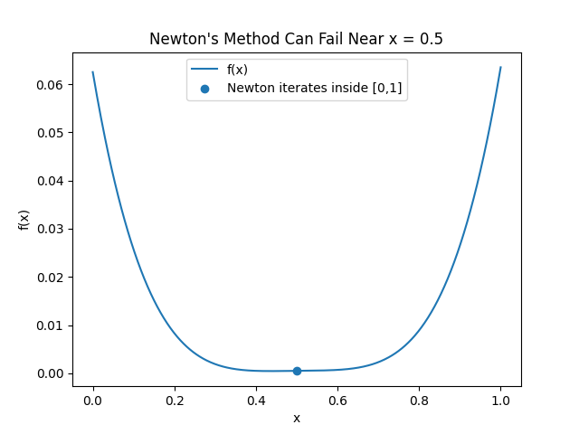

# Homework12_12412639_ WangSiyu

# Lab Session - Completed Answers

## Task 1

### Q1. Only two solutions

Use **dichotomous search** around the midpoint:

$$
x_1=0.5-\varepsilon,\qquad x_2=0.5+\varepsilon
$$

where $\varepsilon>0$ is very small.

For minimization:

- If $f(x_1)<f(x_2)$, the minimizer is in $[0,x_2]$.
- If $f(x_1)>f(x_2)$, the minimizer is in $[x_1,1]$.
- If $f(x_1)=f(x_2)$, the minimizer is in $[x_1,x_2]$.

The worst-case interval length is approximately

$$
0.5+\varepsilon
$$

which approaches $0.5$.

------

### Q2. Only three solutions

Use a finite-budget Fibonacci-style search.

First evaluate

$$
x_1=\frac{1}{3},\qquad x_2=\frac{2}{3}.
$$

If $f(x_1)<f(x_2)$, keep the interval $[0,2/3]$.
Then evaluate

$$
x_3=\frac{1}{3}-\varepsilon.
$$

Compare $f(x_3)$ and $f(x_1)$:

- If $f(x_3)<f(x_1)$, keep $[0,1/3]$.
- Otherwise, keep ([x_3,2/3]).

If $f(x_1)>f(x_2)$, keep the interval $[1/3,1]$.
Then evaluate

$$
x_3=\frac{2}{3}+\varepsilon.
$$

Compare $f(x_2)$ and $f(x_3)$:

- If $f(x_3)<f(x_2)$, keep $[2/3,1]$.
- Otherwise, keep $[1/3,x_3]$.

The final worst-case interval length is approximately

$$
\frac{1}{3}+\varepsilon.
$$

------

### Q3. Twenty solutions

Use **Fibonacci search**, which is optimal for a known finite number of evaluations.

Let

$$
F_1=1,\quad F_2=1,\quad F_3=2,\ldots
$$

For $N=20$ evaluations,

$$
F_{19}=4181,\qquad F_{20}=6765,\qquad F_{21}=10946.
$$

The first two points are

$$
x_1=\frac{F_{19}}{F_{21}}=\frac{4181}{10946}\approx 0.381966,
$$

$$
x_2=\frac{F_{20}}{F_{21}}=\frac{6765}{10946}\approx 0.618034.
$$

Then compare $f(x_1)$ and $f(x_2)$, discard the worse side, reuse one old point, and add one new point according to the Fibonacci ratio for the remaining number of evaluations.

After 20 evaluations, the guaranteed final interval length is approximately

$$
\frac{1}{F_{21}}=\frac{1}{10946}\approx 9.14\times 10^{-5}.
$$

Golden-section search is a simpler near-equivalent method, using the ratio

$$
\tau=\frac{\sqrt{5}-1}{2}\approx 0.618034.
$$

------

### Q4. Twenty solutions when (f'(x)) is available

Use **bisection on the derivative**.

Start with

$$
[a,b]=[0,1].
$$

For $i=1,\ldots,20$:

$$
x_i=\frac{a+b}{2}.
$$

Then compute $f'(x_i)$.

- If $f'(x_i)>0$, the minimizer is on the left, so set $b=x_i$.
- If $f'(x_i)<0$, the minimizer is on the right, so set $a=x_i$.
- If $f'(x_i)=0$, then $x_i$ is a minimizer.

After 20 derivative evaluations, the interval length is at most

$$
\frac{1}{2^{20}}\approx 9.54\times 10^{-7}.
$$

This is much smaller than the interval obtained by function-value-only Fibonacci search.

------

### Q5. A function where Newton’s method does not work well

One example is

$$
f(x)=(x-0.5)^4+0.001x,\qquad x\in[0,1].
$$

Its derivatives are

$$
f'(x)=4(x-0.5)^3+0.001,
$$

$$
f''(x)=12(x-0.5)^2.
$$

The function is unimodal on ([0,1]), and its minimizer is approximately

$$
x^*\approx 0.437004.
$$

Newton’s method for minimization uses

$$
x_{k+1}=x_k-\frac{f'(x_k)}{f''(x_k)}.
$$

At (x_0=0.5),

$$
f''(0.5)=0,
$$

so Newton’s method is undefined. Even near (0.5), the denominator is very small. For example, if (x_0=0.501), the Newton step jumps far outside ([0,1]). Therefore, Newton’s method does not work well for some initial solutions.



------

## Task 2

### Mathematical results

For two random points $A,B\in[0,1]^m$, $A$ is dominated by $B$ if

$$
B_i\le A_i \quad \text{for all } i.
$$

Because each objective has probability (1/2) of satisfying (B_i\le A_i),

$$
P(A\text{ is dominated by }B)=\left(\frac{1}{2}\right)^m.
$$

For $n$ random points in ([0,1]^m), the expected number of non-dominated solutions is

$$
E[M_{n,m}]=n\int_{[0,1]^m}\left(1-\prod_{i=1}^m x_i\right)^{n-1}dx.
$$

For (m=2), this simplifies to the harmonic number:

$$
E[M_{n,2}]=H_n=\sum_{k=1}^n \frac{1}{k}.
$$

## Final answers

| Problem                                         | Result                       |
| ----------------------------------------------- | ---------------------------- |
| (1) (P(A) dominated by (B)), (m=2)              | $1/4=0.25$                   |
| (2) (P(A) dominated by (B)), (m=4)              | $1/16=0.0625$                |
| (3) (P(A) dominated by (B)), (m=10)             | $1/1024\approx0.0009765625$  |
| (4) Expected non-dominated count, (n=200,m=2)   | $H_{200}\approx5.878030948$  |
| (5) Expected non-dominated count, (n=2000,m=2)  | $H_{2000}\approx8.178368104$ |
| (6) Expected non-dominated count, (n=200,m=10)  | $\approx180.176091279$       |
| (7) Expected non-dominated count, (n=2000,m=10) | $\approx1377.773984129$      |

```sh
Dominance probabilities                                         
m= 2: exact=0.2500000000, MC=0.2504050000                       
m= 4: exact=0.0625000000, MC=0.0626130000                       
m=10: exact=0.0009765625, MC=0.0009450000                       
                                                                
Expected number of non-dominated solutions                      
n= 200, m= 2: exact=5.878031, MC=5.887000, SE=0.029152, trials=5000                                                             
n=2000, m= 2: exact=8.178368, MC=8.110000, SE=0.084267, trials=1000                                                             
n= 200, m=10: exact=180.176091, MC=180.092000, SE=0.307539, trials=500
n=2000, m=10: exact=1377.773984, MC=1380.620000, SE=7.613355, trials=50
```

