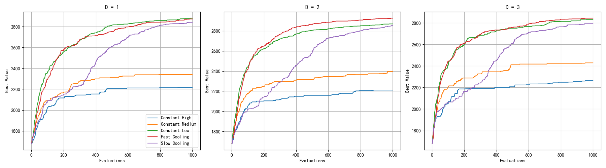

# Lab Session

## 问题描述

你有一个包含 100 个物品的背包问题，带有 10 个约束条件。

$$
\text{Maximize } f(x) = \sum_{i = 1}^{100} v_i x_i \quad \text{Subject to} \sum_{i = 1}^{100} w_{ij} x_i \leq W_j, \quad j = 1,2,\dots,10,
$$
$$
\text{and} \quad x_i \in \{0,1\}, \quad i = 1,2,\dots,100
$$

首先，我们按如下方式创建一个初始可行解：按照物品 1, 物品 2, ..., 物品 100 的顺序，将物品逐一放入背包。如果第 $k+1$ 个物品无法放入背包，则初始可行解由第 1, 2, ..., $k$ 个物品构成。我们将当前解的邻域定义如下："邻域是与当前解的汉明距离为 $D$ 的二进制字符串（长度为 100）"。研究三种 $D$ 的取值：$D = 1, 2, 3$。终止条件设为 1000 次解评估。在此条件下，使用多种冷却策略（例如，恒定高温、恒定低温、恒定中温、快速降温、慢速降温）将模拟退火算法应用于该背包问题。

---

## 解的表达

解：一个 100 维的二进制向量。

## 约束处理

你可以使用任意约束处理技术，例如：

### (i) 修复法
按照预定义的顺序或随机移除物品，如果解不可行，则将其修复为可行解。此修复过程不计入解评估次数。例如，当一个可行解 `10001000...00` 是通过从当前解 `11101000...00` 中移除两个物品得到时，只有得到的可行解被计为新的已评估解。

### (ii) 惩罚法
如果解不可行，则对 $f(\pmb{x})$ 加上一个惩罚值（取决于总约束违反量）。在这种情况下，即使解不可行，每个解都被视为已评估解。

---

## 结果比较

通过绘制下图来比较结果：

"capacity for ten constraints.xlsx": with size 1x10, and each column is the capacity of each constraint
"value for 100 items.xlsx": with size 100x1, and each row is the value of each item
"weight for ten constraints.xlsx": with size 100x10, and each row corresponds to each item and each column corresponds to each constraint